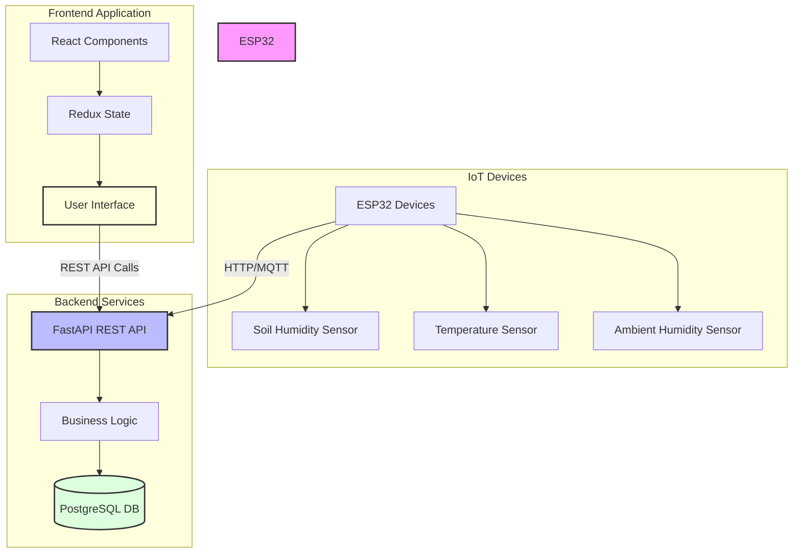

# agro-sensor-hub-server
Repositorio para almacenamiento y visualización de datos del los dispositivos ESP32 con sensores de humedad del suelo, temperatura y humedad del ambiente.

## Arquitectura del Sistema



### Ejecutar localmente

Para ejecutar este proyecto localmente necesitarás tener instalado `docker compose` en tu equipo. 

copia el archivo `.env.example` y crea un archivo `.env` en este mismo directorio.

Modifica las variables de ambiente para tu base de datos:
```
POSTGRES_USER=postgres
POSTGRES_PASSWORD=postgres
POSTGRES_DB=agro_sensor_hub
POSTGRES_HOST=postgres
```

Para iniciar la aplicación en segundo plano con reinicio automático, ejecuta:
```bash
docker compose up -d
```

Este comando:
- `-d`: Ejecuta los contenedores en segundo plano (modo detached)
- Los contenedores se reiniciarán automáticamente si el sistema se reinicia
- Los logs se pueden ver con `docker compose logs -f`

### Ejecutar solo la base de datos

Si necesitas ejecutar solo la base de datos PostgreSQL:
```bash
docker compose up -d postgres
```

