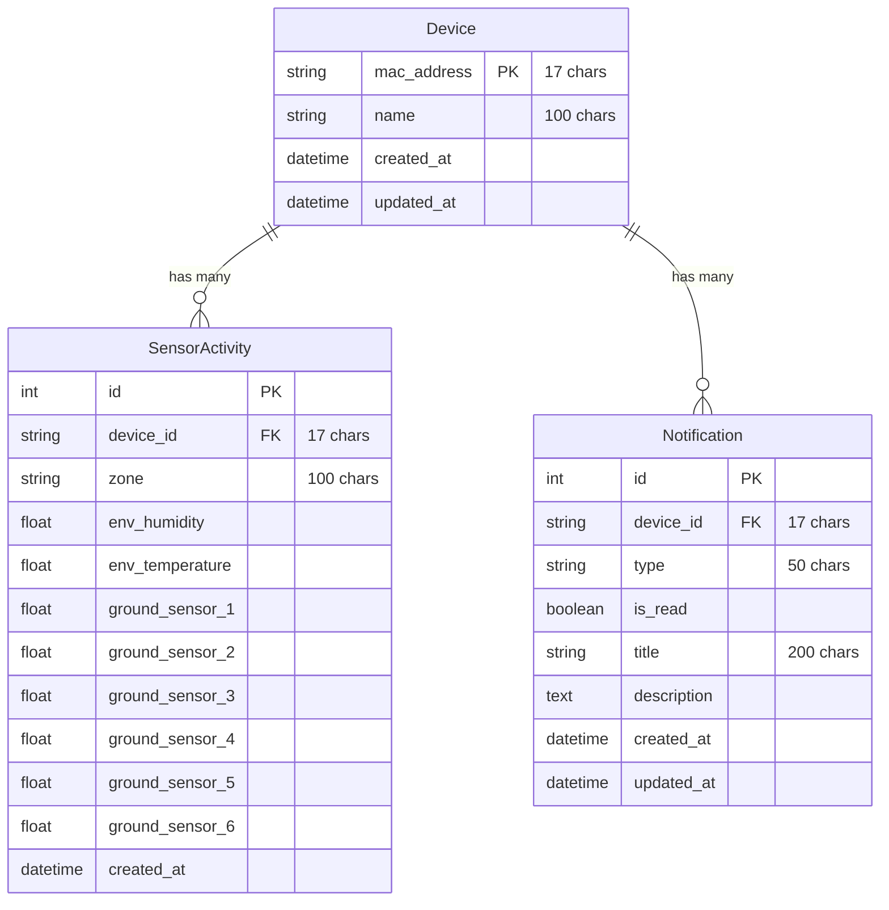

# Database Models Documentation

This document describes the database models used in the Agro Sensor Hub Server.

## Tables

### Notifications Table

The `notifications` table stores system notifications related to devices.

| Column | Type | Description | Constraints |
|--------|------|-------------|-------------|
| id | Integer | Primary key identifier | Primary Key, Auto-increment |
| device_id | String(17) | MAC address of the device | Foreign Key to devices.mac_address, Not Null |
| type | String(50) | Type of notification | Not Null |
| is_read | Boolean | Flag indicating if notification was read | Not Null, Default: false |
| title | String(200) | Notification title | Not Null |
| description | Text | Detailed notification description | Nullable |
| created_at | DateTime | Timestamp when notification was created | Default: current timestamp |
| updated_at | DateTime | Timestamp when notification was last updated | Default: current timestamp, Auto-updates |

### Sensor Activities Table

The `sensor_activities` table stores sensor readings from ESP32 devices.

| Column | Type | Description | Constraints |
|--------|------|-------------|-------------|
| id | Integer | Primary key identifier | Primary Key, Auto-increment |
| device_id | String(17) | MAC address of the device (Format: XX:XX:XX:XX:XX:XX) | Foreign Key to devices.mac_address, Not Null, Indexed |
| zone | String(100) | Zone where the sensor is located | Nullable |
| env_humidity | Float | Environmental humidity reading | Nullable |
| env_temperature | Float | Environmental temperature reading | Nullable |
| ground_sensor_1 | Float | Ground sensor 1 reading | Nullable |
| ground_sensor_2 | Float | Ground sensor 2 reading | Nullable |
| ground_sensor_3 | Float | Ground sensor 3 reading | Nullable |
| ground_sensor_4 | Float | Ground sensor 4 reading | Nullable |
| ground_sensor_5 | Float | Ground sensor 5 reading | Nullable |
| ground_sensor_6 | Float | Ground sensor 6 reading | Nullable |
| created_at | DateTime | Timestamp when reading was recorded | Default: current timestamp |

## Relationships

- Both tables have a foreign key relationship with the `devices` table through the `device_id` column, which references the `mac_address` column in the devices table.

## Entity Relationship Diagram

The diagram above shows the relationships between the models:
- One Device can have many SensorActivities (1:N relationship)
- One Device can have many Notifications (1:N relationship)
- Both SensorActivity and Notification models reference the Device through its `mac_address` as a foreign key
